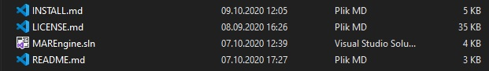

# How to install MAREngine

The version, currently the only one available, is prepared for Windows 10 32-bit. OpenGL libraries (32-bit versions) are downloaded and added by default to linker, so you do not have to download them again. Only dependency is actually this repository.

# Software

The most needed application for MAREngine on Windows is Visual Studio 2019. Through it I am able to compile sources correctly. CMake is also added 
for future integration with Linux Operating Systems.

# Dependencies

All requirements are added to this repository! You need to compile sources for your machine!

- OpenGL (4.6.0 used in this project)
- stb-image (v2.25)
- Dear ImGui (v1.77 from docking branch)
- spdlog (1.6.0)
- SerialPort

# Installation

Please, do not download repository as a .zip file, because you will not fullfil dependencies such as submodules above!

## Windows

### #1 The easiest way

1. Clone repository (with submodules, cause I use ImGui, spdlog, serialport and MARMaths from its own sources!)

```
git clone --recurse-submodules https://github.com/mregussek/MAREngine.git
```

2. Open MAREngine.sln (located in main directory).

<p align="center">
  
</p>

3. Make sure, that selected target is x86 (no x64!!!)

<p align="center">
  
</p>

4. Compile ;)

### #2 CMake on Windows

1. Clone repository (with submodules, cause I use ImGui, spdlog, serialport and MARMaths from its own sources!)

```
git clone --recurse-submodules https://github.com/mregussek/MAREngine.git
```

2. Open CMake (CMake-GUI in my case)
3. Select proper paths!
- Where is the source code: Here please select path, where you cloned repository!
- Where to build binaries: Please select path to repository with /build directory!

Examples:
- Where is the source code: *C:/Path/to/MAREngine*
- Where to build binaries: *C:/Path/to/MAREngine/build*

4. Press **Generate** button!

<p align="center">
  
</p>

5. New window will be opened. Here make sure, that you choose generator for Win32!)

<p align="center">
  
</p>

6. Press **Finish**. CMake will generate all needed files.
7. Select **Open Project** button. You will be able to compile project.
8. Select **MAREngine** as a starting project. Then project should be marked as bold.

<p align="center">
  
</p>

9. Compile ;)

