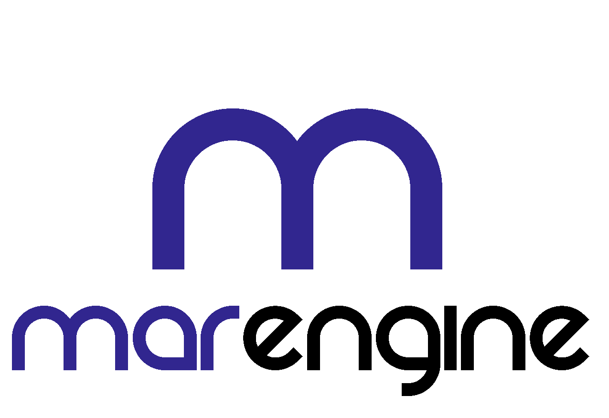

  

# MAREngine

MAREngine is a AR engine for abstracting 3D models in real world. Now the engine is based on OpenGL library.

## Installation

For installation process check the [INSTALL.md](https://github.com/Mregussek/MAREngine/blob/dev/INSTALL.md) file.

## Contributing

Pull requests are welcome. For major changes, please open an issue first to discuss what you would like to change.

Please make sure to update tests as appropriate.

## Author

Mateusz Rzeczyca

info@mateuszrzeczyca.pl

## License

See the LICENSE.md file for details
