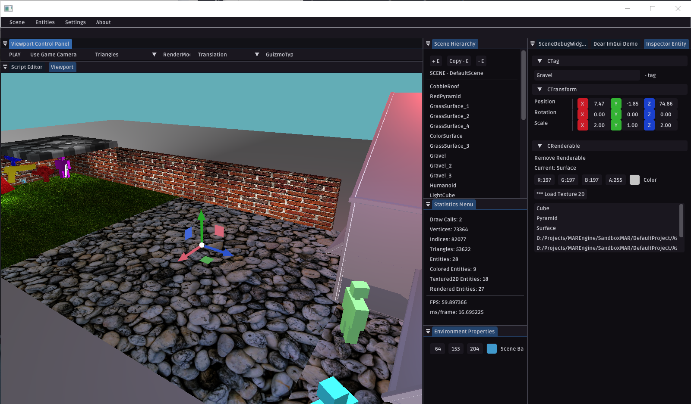
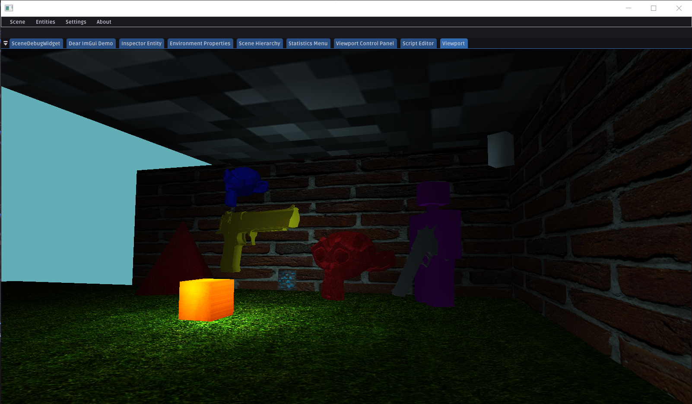
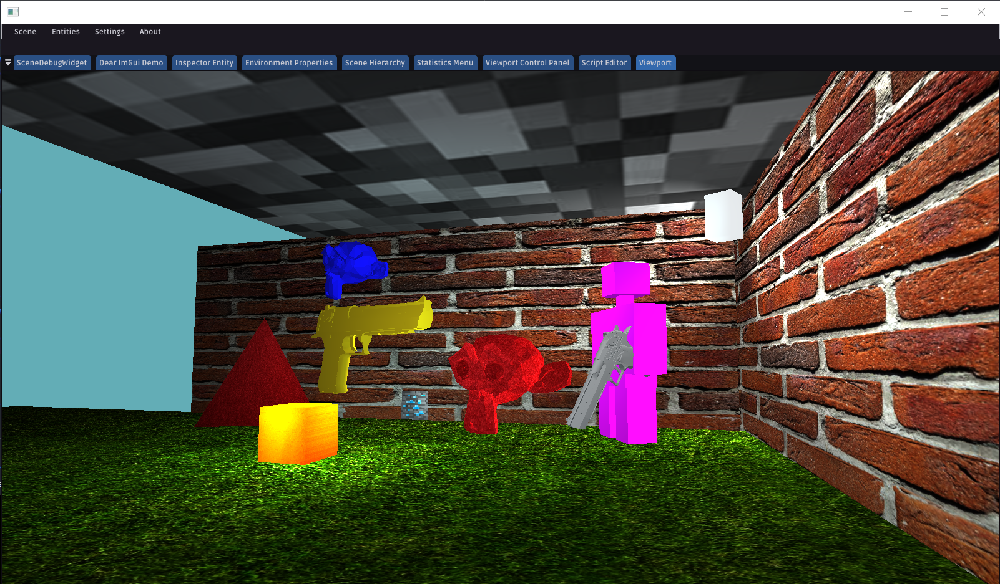
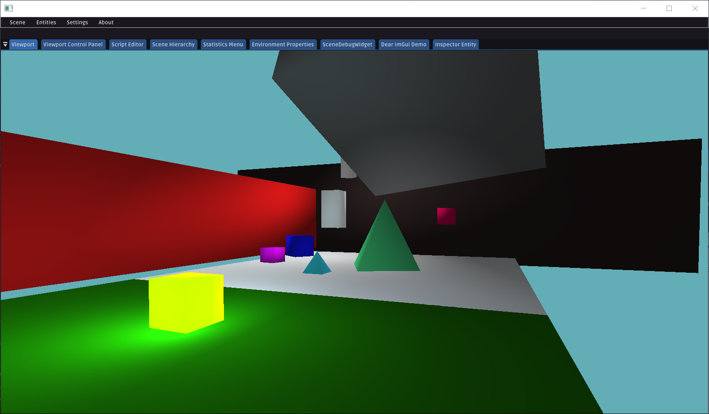
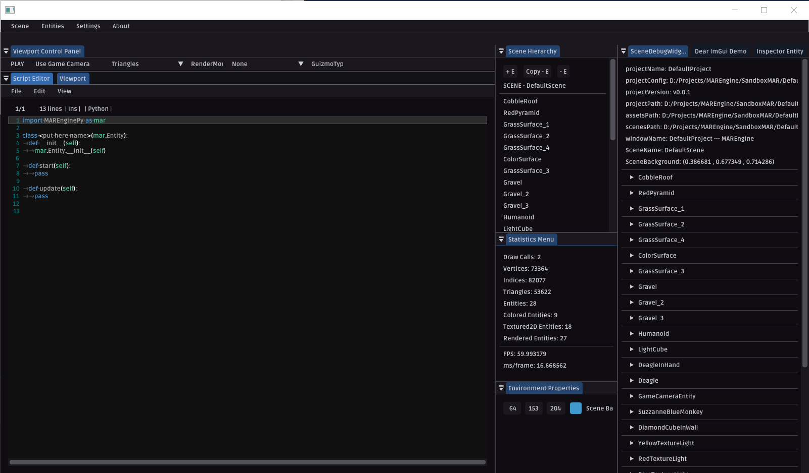

# MAREngine

  

## 3D Free and Open Source Game Engine

MAREngine is an educational 3D game engine written in modern C++. It is created with a dream of easy and intuitive interface for everyone. You can download MAREngine completely freely and release your creativity - create games you imagine.

  

## Documentation

You can learn everything about the engine at the [documentation page](https://marengine.readthedocs.io/).

## Get MAREngine

### Official Binaries

I will make them available soon.

### Compiling from source

Check the [installation guide](https://github.com/Mregussek/MAREngine/blob/master/INSTALL.md) for compilation instructions.

## Versions && Releases

MAREngine releases come with versions in format X.Y.Z where X stands for major release, Y for minor release and Z for bug fixes or non-significant changes.

## Contributing

Right now MAREngine is being developed only by me, Mateusz Rzeczyca. I would appreciate every help and I want to encourage you to start contributing to MAREngine. In [contributing guide](https://github.com/Mregussek/MAREngine/blob/master/CONTRIBUTING.md) you can find all information needed.

## License

See the [LICENSE.md](https://github.com/Mregussek/MAREngine/blob/master/LICENSE.md) file for details

## Screenshots

  

  

  

  

